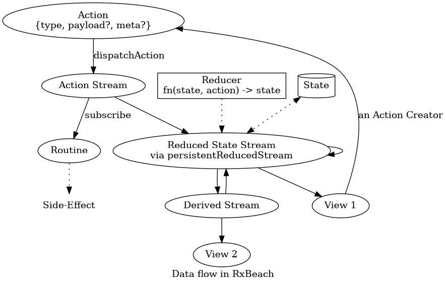

# RxBeach
> Chill with streams at the RxBeach

Welcome to the documentation of RxBeach!

RxBeach is a toolbox for creating applications that use streams to manage
state. This documentation is a work in progress.

## Prerequisite knowledge

Before you dive into this documentation and start working on your application,
you should have a good understanding of the following:

1. The Model - ViewModel - View pattern
2. Observables and streams
3. Actions / Flux standard action / Redux

We recommend these articles to get a refresher on those subjects:

1. [In-Depth Overview of Flux](https://facebook.github.io/flux/docs/in-depth-overview/)
2. [Idiomatic Redux](https://blog.isquaredsoftware.com/series/idiomatic-redux/)
   (article series)

## Brief overview

This diagram shows how Actions flow through (RxJs) Streams to produce State and side-effects and how 
Views are subscribed to streams:



Notice that despite the singular, there will be many (possibly parallel streams), routines etc.
The application state is spread across multiple state streams. Combined, all of the base streams represent the current application state .

### A complete example

```js
enum Module { DASHBOARD, … }
// action creator
const showModule = actionCreator<Module>("[navigation] show module");
/* When invoked , will produce st. like:
const action = {
  type: Symbol("[navigation] show module"),
  payload: Module.DASHBOARD,
  meta: {
    dispatchedAt: new Date(),
    dispatchedBy: new Error()
  }
};
*/

// state
type NavigationState = { selectedModule: Module; };
const defaultNavigationState: NavigationState = {  selectedModule: Module.DASHBOARD };

// reducer
const handleShowModule = reducer(
  showModule,  // could also be another stream
  (state: NavigationState, selectedModule) => ({
    ...state,
    selectedModule // could also do some calculations / transformations on it
}));

// reduced state stream
const reducers = [handleShowModule];
const navigation$ = persistentReducedStream(
  'navigation$',
  defaultNavigationState,
  reducers
);
// the stream also must be started, e.g. via:
stateStreamRegistry.startReducing(navigation$);
// (Side-)effects via routines:
const logModuleChange = routine(
  ofType(showModule), // filter
  extractPayload(),
  tap(module => console.log(`Showing module ${module}`))
);
subscribeRoutine(navigation$, logModuleChange)

// UI
type ViewModel = NavigationState;
const View = ({ selectedModule }: ViewModel) => 
  <p>Navigating to: {selectedModule} 
     <button onClick={dispatchAction(showModule(DASHBOARD))} />
  </p>;
const ConnectedView = connect(View, navigation$);
```

## Diving in

The sidebar contains all the documentation articles. We advise you read through
all the articles under "Fundamentals" in the order they are listed, and then
read the articles under "Recipes" and "Techniques" as you need them.

Remember that all the functions from RxBeach are also documented with JSDoc.
Make sure to read that reference documentation as well. It should be available
through your IDE.

## Development

[The roadmap](roadmap.md) is an introduction to the goals and considerations
behind RxBeach, and also lists some of the planned features, with specs, that
are up for grabs.
